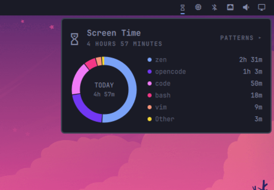
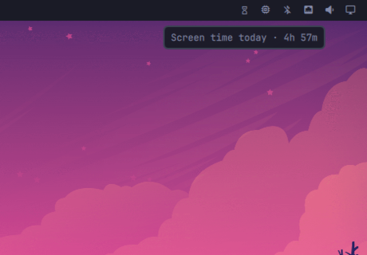

# Screen Time

Per-app screen time for the Omarchy bar. A lightweight service tracks how long
each app keeps focus, the bar shows today's total, and a popup breaks it down
into a donut chart with usage insights.

<p align="center">
  
  
  
  
</p>

## Features

- **Per-app tracking** — focus time is accrued per app; idle, locked and
  desktop time is never counted.
- **Terminal-aware** — while a terminal is focused, `resolve_app.py` reports
  what is actually running inside it (`opencode`, not `foot`), re-resolving
  every few seconds. Browser subprocesses are canonicalized into one app.
- **Donut chart** — hover a legend row to highlight its slice, dim the rest,
  and read the app's name and time in the centre. Apps beyond the six biggest
  fold into an "Other" slice.
- **Insights** — press `p` (or click **PATTERNS**) to reveal top app,
  today vs. yesterday, and your busiest day. `g` / `G` scroll to top / bottom.
- **Icon-only mode** — right-click the bar widget to toggle glyph-only; the
  choice is remembered.
- **Private by design** — history is local append-only JSON, pruned after
  31 days. Colors are generated from your theme's accent.

## Install

```bash
omarchy plugin add https://github.com/ax1g/quickshell-screentime-plugin.git
omarchy plugin enable agx.screen-time
```

Requires Omarchy, Hyprland, and a Nerd Font (for the glyphs).

## Data

Stored at `~/.config/omarchy/screen-time/history.json` as
`{ "days": { "<YYYY-MM-DD>": { "total": <ms>, "apps": { "<appId>": <ms> } } } }`.
Delete the file to reset tracking.

## Development

Hot-reloads on save, so iterate via a symlink:

```bash
ln -s "$PWD" ~/.config/omarchy/plugins/agx.screen-time
node --check Model.js && node --test tests/model.test.js
python3 -m unittest discover -s tests
```

CI runs these checks on every push.

## License

MIT
