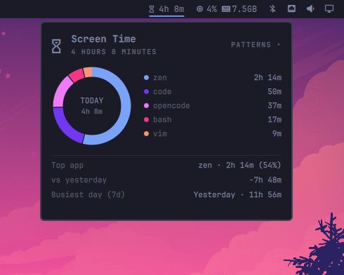
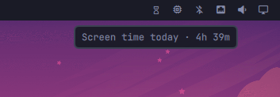

# Screen Time

Track how long you actually spend in each app, right from the bar. A
long-running service accrues focused time per app, a bar widget shows today's
total, and a popup breaks it down as a donut chart with hover highlighting
plus a few behaviour insights — all themed, all persisted.





## Features

- **Per-app tracking** — a long-running service listens to the compositor's
  active toplevel and accrues focused time per app. Idle, locked, or desktop
  time is not counted.
- **Terminal-aware** — when a terminal is focused, `resolve_app.py` walks
  `/proc` to report what is actually running inside it (e.g. `opencode`
  rather than `foot`), re-resolving every few seconds so the foreground
  command changing is picked up. Browsers are canonicalized (a browser's
  `zen-bin` / `Web Content` processes all count as one app).
- **Donut chart** — the popup renders today's apps as a donut with a legend.
  Hover a legend row to highlight its slice, dim the others, and see the
  app's name and time in the centre. Apps beyond the six biggest are folded
  into an "Other" slice so the chart stays readable.
- **Behaviour insights** — press `p` (or click the **PATTERNS** marker) to
  reveal top app, today vs. yesterday, and the busiest day of the last 7.
  `g`/`G` jump to the top/bottom of the panel.
- **Icon-only mode** — right-click the bar widget to shrink it to a single
  glyph or back to "glyph + time"; the choice is remembered.
- **Persistent history** — data survives shell restarts and plugin reloads;
  days older than 31 are pruned automatically.
- **Themed** — slice colours are generated from the theme accent, so the
  palette follows theme swaps.

## Requirements

- Omarchy shell (Quickshell-based)
- Hyprland (`hyprctl`, used to resolve the app running inside a focused
  terminal)
- A Nerd Font for the glyphs (`󰔟`) — most Omarchy themes ship one

## Install

```bash
omarchy plugin add https://github.com/ax1g/quickshell-screentime-plugin.git
omarchy plugin enable agx.screen-time
```

or install by hand:

1. Clone into `~/.config/omarchy/plugins/agx.screen-time/`
2. `omarchy-shell shell rescanPlugins`
3. `omarchy plugin enable agx.screen-time`

## Remove

```bash
omarchy plugin remove agx.screen-time
```

That disables and removes the plugin. Your history is kept at
`~/.config/omarchy/screen-time/history.json`; delete it to clear your data.

## How tracking works

The service listens to the compositor's active toplevel and accrues focused
time per app. Idle, locked, or desktop time is not counted. When a terminal
is focused, a resolver (`resolve_app.py`) walks `/proc` to find the process
actually running inside it (e.g. `opencode` rather than `foot`), re-resolving
every few seconds in case the foreground command changes. Focus is credited
to the day it started on, so a bucket spanning midnight still lands on the
right day.

## Data

Screen-time history is stored as append-only JSON at
`~/.config/omarchy/screen-time/history.json`, shaped as
`{ "days": { "<YYYY-MM-DD>": { "total": <ms>, "apps": { "<appId>": <ms> } } } }`
(the `days` wrapper is Quickshell's JsonAdapter key for the adapter property).
Days older than 31 are pruned automatically. Deleting the file resets
tracking.

## Development

The plugin hot-reloads when its files change, so you can iterate without
restarting the shell:

1. Symlink the repo into your plugin directory:
   `ln -s "$PWD" ~/.config/omarchy/plugins/agx.screen-time`
2. Edit the QML/JS/Python files — changes apply on save.
3. Restart the shell if the bar layout needs to re-run:
   `omarchy restart shell`

Run the checks locally:

```bash
node --check Model.js && node --test tests/model.test.js
python3 -m py_compile resolve_app.py tests/test_resolve_app.py
python3 -m unittest discover -s tests
```

The CI workflow runs these on every push.

## License

MIT
