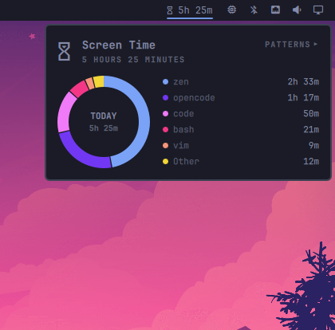
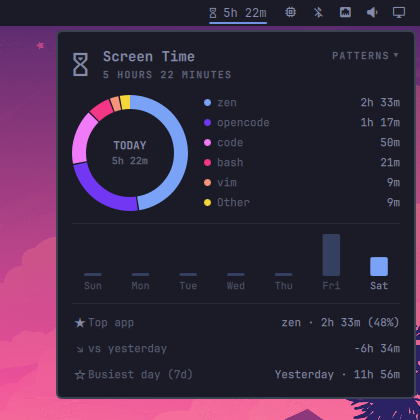

# Screen Time

Per-app screen time for the Omarchy bar. A lightweight service tracks how long
each app keeps focus, the bar shows today's total, and a popup breaks the day
down into a donut chart with a 7-day usage trend.

<p align="center">
  
  
</p>

## At a glance

- **Time in the bar** — today's total, live, right next to your tray.
- **Icon-only mode** — right-click to collapse the widget to a single glyph; remembered.
- **Per-app tracking** — focus time per app; idle, locked and desktop time never counted.
- **Terminal-aware** — with a terminal focused, `resolve_app.py` reports what's actually running inside it (`opencode`, not `foot`), re-resolving every few seconds; browser subprocesses are canonicalized into one app.
- **Donut breakdown** — today's apps in a ring with a legend and the day's total in the centre; six biggest + "Other".
- **Usage patterns** — press `p` (or click **PATTERNS**) for a 7-day trend, top app, vs. yesterday, and your busiest day.
- **Private by design** — local append-only JSON, pruned after 31 days; colours generated from your theme's accent.

## Usage

Click the bar widget to open the panel. `Esc` closes it, `p` toggles the
patterns section, and `j` / `k` (or arrows) scroll if the panel overflows.
Right-click the widget to switch between "glyph + time" and glyph-only.

## Install

```bash
omarchy plugin add https://github.com/ax1g/quickshell-screentime-plugin.git
omarchy plugin enable agx.screen-time
```

Requires Omarchy, Hyprland, and a Nerd Font for the glyphs.

## Data

History is stored at `~/.config/omarchy/screen-time/history.json` as
`{ "days": { "<YYYY-MM-DD>": { "total": <ms>, "apps": { "<appId>": <ms> } } } }`.
Focus is credited to the day it started on, so a session spanning midnight
still lands on the right day. Delete the file to reset tracking.

## Development

The plugin hot-reloads on save, so you can iterate through a symlink:

```bash
ln -s "$PWD" ~/.config/omarchy/plugins/agx.screen-time
node --check Model.js && node --test tests/model.test.js
python3 -m unittest discover -s tests
```

CI runs the same checks on every push.

## License

MIT
