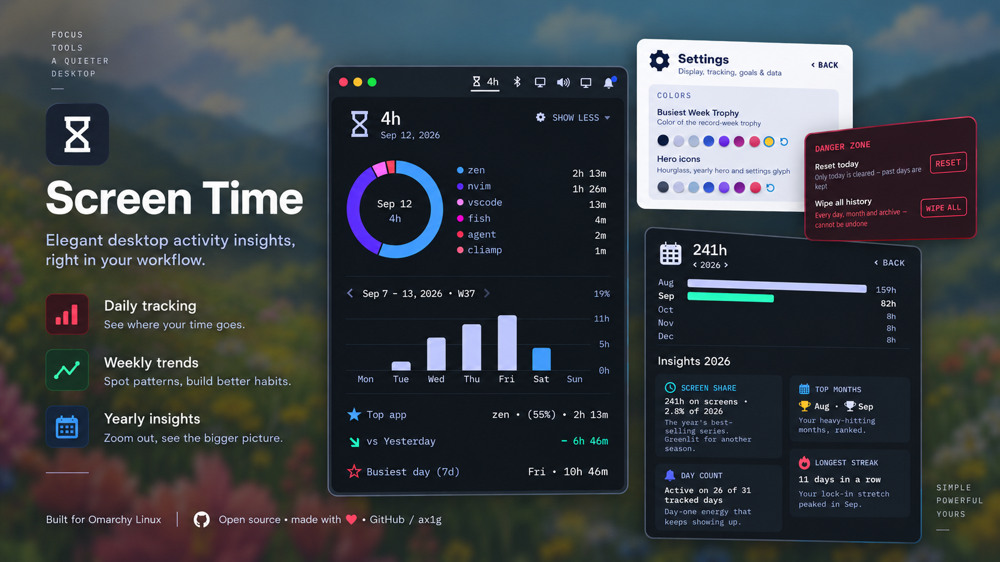
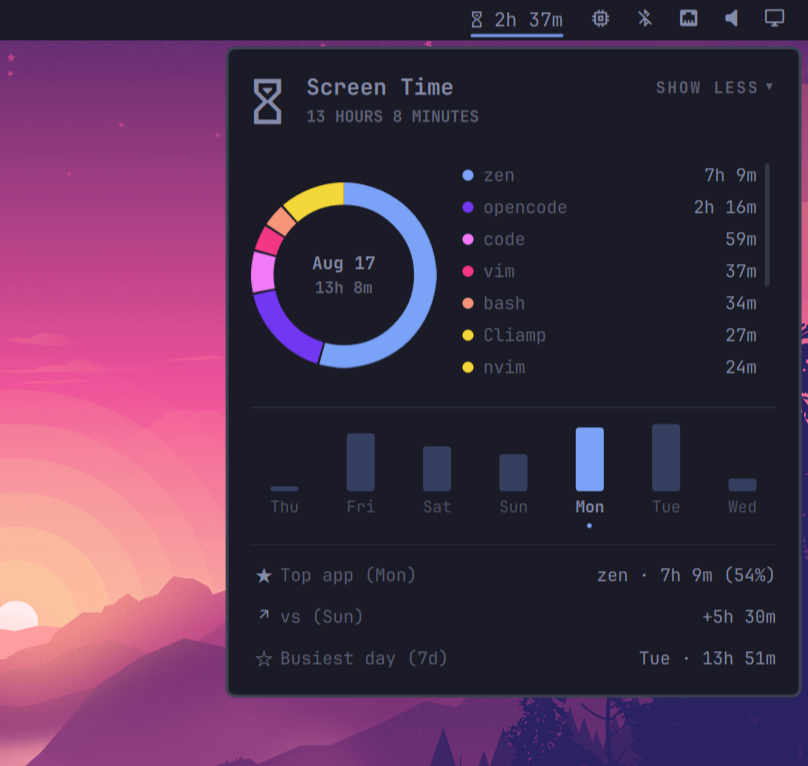
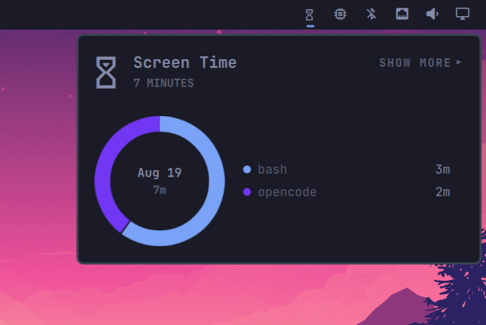
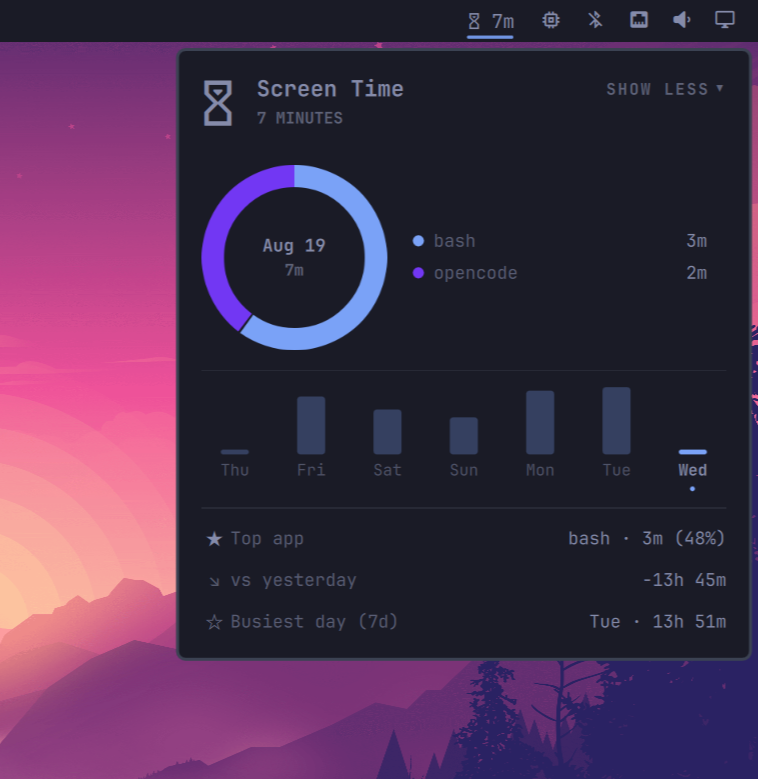

<p align="center">
  
</p>

# Screen Time

Per-app screen time for the Omarchy bar. A lightweight service tracks how long
each app keeps focus, the bar shows today's total, and a popup breaks the day
down into a donut chart with a 7-day usage trend.

<table>
  <tr>
    <td></td>
    <td>
      <br/>
      
    </td>
  </tr>
</table>

## Features

| Feature | What it does |
| --- | --- |
| **Time in the bar** | Today's total, live, right next to your tray. |
| **Per-app tracking** | Focus time per app; idle, locked, asleep and desktop time never counted. |
| **Terminal-aware** | A focused terminal reports what's actually running inside it (`opencode`, not `foot`), re-resolved every few seconds. |
| **Steam-aware** | `steam_app_123456` becomes the real game title, read from local Steam metadata. |
| **Donut breakdown** | Today's apps as a ring: six biggest + "Other", day total in the centre. |
| **Slice hover** | Hover the ring to dim the other slices and preview that app's name and share in the centre. |
| **Clickable week bars** | Click a day in the 7-day trend to view its apps and insights; click again to return to today. |
| **13-week trend** | Paginated Mon-Sun bars with `< Aug 2026 · W34 >` navigation; today's bar in your theme accent. |
| **Week total** | Sits in the graph header; click it to flip between time and its share of the week's 168 hours. |
| **Yearly overview** | The hourglass opens a full-card view: one bar per month across all recorded years, exact totals on hover. |
| **Hourglass easter egg** | It flips over on the hour; hover for gold sparkles around your cursor. |
| **Scrollable app list** | Bounded legend with a thin scrollbar; Show More expands the full list inline. |
| **Clean app names** | Reverse-DNS IDs shortened and lowercased (`com.github.user.Codium` → `codium`). |
| **Usage patterns** | Press `p` for top app, vs. yesterday, and busiest day. |
| **Icon-only mode** | Right-click collapses the widget to a single glyph; remembered. |
| **Keyboard-first** | `Esc` closes, `p` toggles patterns, `j`/`k`/arrows scroll; mouse wheel works too. |
| **Keybind-friendly** | Summon the panel from a script or keybind via the `agx.screen-time` IPC target. |
| **Private by design** | Local JSON, daily detail pruned after ~3 months (monthly totals kept); colours generated from your theme's accent. |

## Install

```bash
omarchy plugin add https://github.com/ax1g/quickshell-screentime-plugin.git
omarchy plugin enable agx.screen-time
```

Requires Omarchy and Hyprland. A Nerd Font provides the glyphs, and
`python3` (preinstalled on Omarchy) powers terminal and Steam name
resolution — without it the plugin still tracks, but terminals show under
their own name (`foot`, `kitty`) instead of what runs inside them.

## Uninstall

```bash
omarchy plugin disable agx.screen-time
omarchy plugin remove agx.screen-time
```

To also delete the history file:

```bash
rm ~/.config/omarchy/screen-time/history.json
```

## Data

Everything lives in one local file, `~/.config/omarchy/screen-time/history.json`:

```json
{
  "days": {
    "2026-08-16": { "total": 490875, "apps": { "zen": 313349, "opencode": 148706 } }
  },
  "months": {
    "2026-07": 9823400
  }
}
```

- Per-app focus time in milliseconds, keyed by day (`YYYY-MM-DD`).
- Focus is credited to the day it started on, so a session spanning midnight
  still lands on the right day.
- Daily detail older than ~3 months (95 days, matching the 13-week trend) is
  pruned, but its total is folded into a per-month aggregate first — so the
  yearly overview remembers your history even though raw days are forgotten.
  Delete the file to reset.

## Development

The shell hot-reloads the plugin whenever a file changes, so a symlink into
your checkout is all you need to iterate:

```bash
ln -s "$PWD" ~/.config/omarchy/plugins/agx.screen-time
node --check lib/Model.js && node --check lib/State.js
node --test tests/model.test.js tests/state.test.js
python3 -m unittest discover -s tests
```

The same checks run in CI on every push.

## License

MIT
